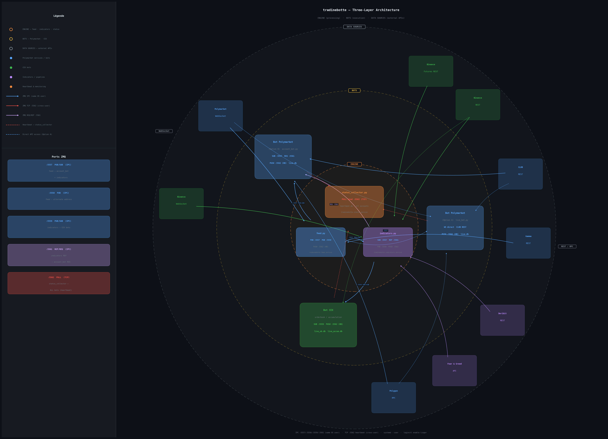

# Process Architecture & ZeroMQ Message Flow

> 🇫🇷 [Version française](design.fr.md)

This document describes the multi-process architecture of tradinebotte: every
process, every ZeroMQ socket, every data flow, and every systemd service unit.

---

## 1. High-resolution architecture diagram



> Three concentric rings: **ENGINE** (status_collector · feed · indicators) at the
> centre, **BOTS** (Polymarket Option A/B · CEX) on the middle ring, and
> **DATA SOURCES** (WebSocket APIs on the left, REST/RPC APIs on the right) on
> the outer ring. Dashed red spokes = heartbeat PUSH → `:5562` TCP. Generated
> by `docs/gen_architecture_diagram.py`.

The ASCII diagram below shows the same topology with explicit socket addresses:

```
╔══════════════════════════════════════════════════════════════════════════════════════════════════╗
║                                    EXTERNAL SERVICES                                            ║
║                                                                                                  ║
║  wss://ws-subscriptions-clob.polymarket.com/ws/market   [Polymarket WebSocket]                  ║
║  https://gamma-api.polymarket.com/markets               [Polymarket Gamma REST]                 ║
║  https://clob.polymarket.com                            [Polymarket CLOB REST]                  ║
║  wss://stream.binance.com   https://api.binance.com     [Binance WS + REST]                     ║
║  https://polygon.drpc.org                               [Polygon RPC]                           ║
╚══════╤══════════════════════════════════╤═══════════════╤════════════════════════════════════════╝
       │ single WS connection             │               │ Binance WS/REST (klines, depth, trades)
       ▼                                  │               ▼
┌──────────────────────────────┐          │    ┌───────────────────────────────────────────────┐
│         feed.py              │          │    │            indicators.py                      │
│  tradinebotte-polymarket/    │          │    │     tradinebotte-indicators/                  │
│  [tradinebotte-feed.service] │          │    │  [tradinebotte-indicators.service]            │
│                              │          │    │                                               │
│  PUB bind :5557              │◄─────────┘    │  SUB connect :5557   (feed events)            │
│  IPC: tradinebotte-feed.sock │               │  REP bind :5561      (dynamic registration)  │
└──────────────┬───────────────┘               │  PUB bind :5559      (computed indicators)   │
               │                               │  IPC: tradinebotte-indicators.sock            │
               │  ZMQ PUB :5557                │       tradinebotte-ind-reg.sock               │
               │  IPC (same-user)              └───────────────────┬───────────────────────────┘
               │  market/book/ping                                  │ ZMQ PUB :5559 IPC (same-user)
       ┌───────┴──────────────────┐                                 │ indicators stream
       │                          │                                 │
       ▼                          ▼                        ┌────────┴──────────────┐
┌──────────────────────┐  ┌───────────────────┐           │                       │
│    account_bot.py    │  │    live_bot.py     │           ▼                       ▼
│ tradinebotte-polymar.│  │ tradinebotte-poly. │  ┌────────────────────┐  ┌────────────────────┐
│ [tradinebotte-       │  │ (accts 2–5,        │  │  orderbook_bot.py  │  │ accumulation_bot.py│
│  account-<acct>.svc] │  │  standalone)       │  │ tradinebotte-cex/  │  │ tradinebotte-cex/  │
│                      │  │                    │  │                    │  │                    │
│ SUB connect :5557    │  │ (direct WS)        │  │ SUB connect :5559  │  │ SUB connect :5559  │
│ REQ connect :5561 ──────────────────────────────────────────────────►│  REP :5561            │
│ PUSH → :5562 (HB)   │  │ PUSH → :5562 (HB)  │  │ PUSH → :5562 (HB)  │  │ PUSH → :5562 (HB)  │
│                      │  │                    │  │                    │  │                    │
│ live.db (SQLite WAL) │  │ live.db            │  │ live_ob.db         │  │ live_accum.db      │
└──────────────────────┘  └───────────────────┘  └────────────────────┘  └────────────────────┘
       │                          │                        │                        │
       │   PUSH :5562             │   PUSH :5562           │   PUSH :5562           │   PUSH :5562
       │   TCP loopback           │   TCP loopback         │   TCP loopback         │   TCP loopback
       │   (cross-user)           │   (cross-user)         │   (cross-user)         │   (cross-user)
       └──────────────────────────┴────────────────────────┴────────────────────────┘
                                                │
                              HEARTBEAT PUSH → tcp://127.0.0.1:5562
                              (every bot, every 3600 s, fires at startup)
                                                │
                                                ▼
                              ┌─────────────────────────────────────────┐
                              │         status_collector.py             │
                              │     tradinebotte-status/                │
                              │  [tradinebotte-status.service]          │
                              │                                         │
                              │  PULL bind tcp://127.0.0.1:5562         │
                              │  heartbeat.db (SQLite — all accounts)   │
                              └─────────────────────────────────────────┘

feed.py also sends its own heartbeat PUSH → :5562  ─────────────────────────────┘
indicators.py also sends its own heartbeat ─────────────────────────────────────┘

─────────────────────────────────────────────────────────────────────────────────
 Transport legend
   IPC   ipc:///run/user/$UID/tradinebotte-<name>.sock  (same OS user, same host)
   TCP   tcp://127.0.0.1:<port>                          (cross-user, same host)
   TCP†  use TRADINEBOTTE_PORT_BASE to shift all ports   (multi-host / multi-stack)
─────────────────────────────────────────────────────────────────────────────────
```

The REQ from `account_bot.py` to `:5561` goes to `indicators.py` for dynamic
stream registration (not to `live_bot.py`). `live_bot.py` has no ZMQ sockets;
the arrow above is solely for spatial clarity.

---

## 2. Deployment modes

Two deployment modes exist. They share the same codebase and strategy files.

### Option A — Standalone (single process)

```
Polymarket WebSocket
        │
        ▼
  ┌───────────────┐
  │  live_bot.py  │  ← WebSocket + signal eval + orders + DB
  └───────────────┘
```

One process does everything: maintains the WebSocket connection, evaluates
signals, places orders, writes the database. Used for single-account setups
(production accounts 2–5).

```bash
python3 tradinebotte-polymarket/live_bot.py
```

### Option B — Multi-bot (feed + N account bots)

```
Polymarket WebSocket
        │
        ▼
  ┌──────────┐
  │ feed.py  │  ← WebSocket only, no keys, no trading
  └────┬─────┘
       │ ZeroMQ PUB  IPC (/run/user/$UID/tradinebotte-feed.sock)
       │
  ┌────┴──────────────────────┐
  ▼                           ▼
┌──────────────────┐  ┌──────────────────┐
│  account_bot.py  │  │  account_bot.py  │  (N instances, isolated)
│  ~/account-a     │  │  ~/account-b     │
└──────────────────┘  └──────────────────┘
```

The feed holds the single WebSocket connection and broadcasts all events. Each
account bot runs the full trading stack independently with its own keys,
database, and strategy parameters.

```bash
python3 tradinebotte-polymarket/feed.py &
TRADINEBOTTE_DIR=~/account-a python3 tradinebotte-polymarket/account_bot.py &
TRADINEBOTTE_DIR=~/account-b python3 tradinebotte-polymarket/account_bot.py &
```

**Feed auto-start:** the first `account_bot.py` to launch starts `feed.py`
automatically. A POSIX file lock (`/tmp/tradinebotte-feed/feed-<hash>.lock`)
ensures exactly one account bot starts the feed; other account bots wait until
the feed is reachable before connecting.

---

## 3. Process inventory

| Process | File | Role | Credentials | ZMQ socket |
|---|---|---|---|---|
| `feed` | `tradinebotte-polymarket/feed.py` | Broadcast-only WebSocket relay | **None** | PUB bind `:5557` |
| `account_bot` | `tradinebotte-polymarket/account_bot.py` | Per-account trading logic | Private key required | SUB connect `:5557`, REQ connect `:5561`, PUSH → `:5562` |
| `live_bot` | `tradinebotte-polymarket/live_bot.py` | Standalone bot: WebSocket + signal + orders + DB | Private key required | PUSH → `:5562` (heartbeat only) |
| `indicators` | `tradinebotte-indicators/indicators.py` | Shared technical indicator pipeline | None | SUB connect `:5557`, PUB bind `:5559`, REP bind `:5561`, PUSH → `:5562` |
| `orderbook_bot` | `tradinebotte-cex/orderbook_bot.py` | Binance OBI scalping; pluggable strategy engines (OBI, DCA, Swing, SwingHold) | Binance API key (optional for paper mode) | SUB connect `:5559`, PUSH → `:5562` |
| `accumulation_bot` | `tradinebotte-cex/accumulation_bot.py` | Long-term BTC spot accumulation: initial buy + OBI dip scale-in + profit ladder | Binance API key | SUB connect `:5559`, PUSH → `:5562` |
| `status_collector` | `tradinebotte-status/status_collector.py` | Heartbeat collector — receives all bots' heartbeats | None | PULL bind `:5562` |

`orderbook_bot` and `accumulation_bot` are Binance bots in the `tradinebotte-cex`
sub-service. They do not participate in the Polymarket feed/account-bot ZeroMQ
topology, but both consume from the shared `indicators` service (ZMQ SUB on `:5559`).
State files: `live_ob.db` / `orderbook_bot.pid` / `orderbook_bot.log` and
`live_accum.db` / `accumulation_bot.pid` / `accumulation_bot.log`. Strategy configs:
`tradinebotte-cex/strategies/scalping/orderbook_btc.json` and
`tradinebotte-cex/strategies/accumulation/btc_accumulation.json`.

---

## 4. ZMQ address table

| Constant | Port | Pattern | Direction | Default address (IPC) | TCP override |
|---|---|---|---|---|---|
| `PORT_FEED` | 5557 | PUB (bind) / SUB (connect) | feed.py → account_bot.py, indicators.py | `ipc:///run/user/$UID/tradinebotte-feed.sock` | `tcp://127.0.0.1:5557` |
| `PORT_FEED_ALT` | 5558 | PUB (bind) alternate | feed.py alternate address | `ipc:///run/user/$UID/tradinebotte-feed-alt.sock` | `tcp://127.0.0.1:5558` |
| `PORT_INDICATORS` | 5559 | PUB (bind) / SUB (connect) | indicators.py → orderbook_bot.py, accumulation_bot.py | `ipc:///run/user/$UID/tradinebotte-indicators.sock` | `tcp://127.0.0.1:5559` |
| `PORT_IND_REG` | 5561 | REP (bind) / REQ (connect) | indicators.py ← account_bot.py (registration) | `ipc:///run/user/$UID/tradinebotte-ind-reg.sock` | `tcp://127.0.0.1:5561` |
| `PORT_STATUS` | 5562 | PULL (bind) / PUSH (connect) | status_collector.py ← all bots (heartbeats) | `tcp://127.0.0.1:5562` | (always TCP — cross-user) |

**Transport rule:** ports 5557, 5558, 5559, 5561 use IPC by default when all
processes share the same OS user. Set `TRADINEBOTTE_PORT_BASE` to switch to TCP.
Port 5562 (heartbeat) always uses TCP loopback because it receives from bots
running as different OS users.

---

## 5. ZeroMQ topology (detailed)

```
                     ┌─────────────────────────────────────────────┐
                     │              EXTERNAL SYSTEMS               │
                     │  Polymarket WebSocket (wss://ws-*.clob...)  │
                     │  Gamma REST API (https://gamma-api.poly...) │
                     │  Binance kline WebSocket + REST API         │
                     └──────────────────┬──────────────────────────┘
                                        │ single WS connection
                                        ▼
                              ┌──────────────────┐
                              │    feed.py        │
                              │  PUB bind :5557   │
                              └─────────┬─────────┘
                                        │ broadcasts: market / book / ping
                          ┌─────────────┼─────────────────┐
                          ▼             ▼                  ▼
               ┌──────────────┐  ┌──────────────┐  ┌──────────────────────┐
               │ account_bot  │  │ account_bot  │  │    indicators.py     │
               │ SUB :5557    │  │ SUB :5557    │  │    SUB :5557         │
               │ REQ :5561 ───┼──┼──────────────┼─▶│    REP bind :5561   │
               │ ~/account-a  │  │ REQ :5561 ───┼─▶│    PUB bind :5559   │
               └──────────────┘  └──────────────┘  └──────────┬───────────┘
                                                               │ indicators
                                                               ▼
                                                    ┌─────────────────────┐
                                                    │   any consumer      │
                                                    │   SUB :5559         │
                                                    └─────────────────────┘
```

**Dynamic registration flow** — at startup, each `account_bot` sends a REQ
to `:5561` declaring which streams it needs. `indicators.py` starts the
corresponding asyncio task if it is not already running and replies
`{"status":"ok","stream_id":"..."}`. All output is broadcast on the single
PUB `:5559`; consumers filter by `stream_id`.

```
account_bot startup:
  REQ → {"cmd":"subscribe","asset":"BTCUSDT","timeframe":"4h",
         "source":"binance_ws","indicators":[{"type":"rsi","period":14}]}
  REP ← {"status":"ok","stream_id":"btc_4h"}
  SUB → :5559  (filter: stream_id == "btc_4h")
```

### Socket types used

| Pattern | Direction | Used by |
|---|---|---|
| `zmq.PUB` bind | 1 → N broadcast | `feed.py`, `indicators.py` |
| `zmq.SUB` connect | N → 1 receive | `account_bot.py`, `indicators.py` |
| `zmq.REP` bind | request/reply server | `indicators.py` |
| `zmq.REQ` connect | request/reply client | `account_bot.py` (at startup) |
| `zmq.PUSH` connect | heartbeat sender | all bots |
| `zmq.PULL` bind | heartbeat receiver | `status_collector.py` |

All messages are single-frame JSON objects. ZeroMQ guarantees atomic delivery
of each frame — no partial messages.

### Default addresses

| Variable | Default | Bound by | Connected by |
|---|---|---|---|
| `TRADINEBOTTE_FEED_ADDR` | IPC auto-detected (`/run/user/$UID/tradinebotte-feed.sock`) | `feed.py` | `account_bot.py`, `indicators.py` |
| `TRADINEBOTTE_INDICATORS_ADDR` | IPC auto-detected (`/run/user/$UID/tradinebotte-indicators.sock`) | `indicators.py` PUB | any consumer |
| `TRADINEBOTTE_INDICATORS_REG_ADDR` | IPC auto-detected (`/run/user/$UID/tradinebotte-ind-reg.sock`) | `indicators.py` REP | `account_bot.py` (startup REQ) |
| `TRADINEBOTTE_STATUS_ADDR` | `tcp://127.0.0.1:5562` | `status_collector.py` PULL | all bots (PUSH) |

All three feed/indicators addresses default to IPC Unix sockets in `/run/user/$UID/` (set 0700
by systemd-logind — kernel-enforced per-UID isolation). Override with `TRADINEBOTTE_PORT_BASE`
to switch to TCP and run multiple independent stacks on the same machine
(e.g. base=5557 for stack A, base=6557 for stack B).

---

## 6. Production account topology

Six accounts run on the same server. Each account runs as a separate OS user.

| Account | Bots running | Deploy version |
|---|---|---|
| acct-1 | feed + indicators + account_bot + status_collector | ef5d23e (bots), bdff296 (status) |
| acct-2 | live_bot (Polymarket grid) | bdff296 |
| acct-3 | live_bot (Polymarket grid) + accumulation_bot (Binance) | bdff296 |
| acct-4 | live_bot (Polymarket) + orderbook_bot + accumulation_bot (Binance) | bdff296 |
| acct-5 | live_bot (Polymarket swing) | bdff296 |
| acct-6 | indicators + feed + account_bot [test-only] | unknown |

**acct-1** runs Option B: feed broadcasts to account_bot; indicators pipeline is shared.
**acct-2 to acct-5** run Option A: standalone live_bot per account.
**acct-6** mirrors the Option B stack for testing; not in production rotation.

All heartbeats from all accounts flow to `status_collector.py` on acct-1 via
`tcp://127.0.0.1:5562`. acct-1 owns the only `heartbeat.db`.

---

## 7. Heartbeat system

### heartbeat_loop (tradinetools/__init__.py)

Every bot runs a background `asyncio` task (`heartbeat_loop`) at startup.

```python
async def heartbeat_loop(
    bot_name: str,
    install_dir: str | None,
    get_extra: Callable[[], dict[str, Any]],
    *,
    mode: str | None = None,
    interval: int = 120,
) -> None:
```

- **Fires immediately** at startup, then every `interval` seconds (default 120 s;
  override with `TRADINEBOTTE_HB_INTERVAL`).
- Builds a JSON payload via `build_heartbeat()` and sends it as a single ZMQ PUSH frame.
- The address resolves from `TRADINEBOTTE_STATUS_ADDR` env var, then
  `default_status_addr()` → `tcp://127.0.0.1:5562`.
- All exceptions are swallowed (collector outage never crashes a bot).
- LINGER=0 ensures clean shutdown even if the collector is unreachable.

### Heartbeat payload schema

```json
{
  "ts":        1745664123,
  "bot_name":  "account_bot",
  "account":   "acct-1",
  "version":   "ef5d23e",
  "status":    "running",
  "bounds_ok": true
}
```

| Field | Type | Description |
|---|---|---|
| `ts` | int | Unix timestamp (seconds) when the heartbeat was built |
| `bot_name` | string | Name of the bot process (`feed`, `account_bot`, `live_bot`, etc.) |
| `account` | string | From `TRADINEBOTTE_ACCOUNT` env var, then `USER`; identifies the OS account |
| `version` | string | Short git hash from `version.stamp` or `TRADINEBOTTE_VERSION` env var |
| `status` | string | Always `"running"` (future: `"degraded"`, `"stopping"`) |
| `bounds_ok` | bool\|null | Optional; set by bots that track strategy parameter bounds |

Bots also merge **family-specific extra fields** into the payload (carried verbatim in the
stored `payload` JSON blob, not as dedicated columns), e.g. `pnl_total`, `daily_pnl`,
`capital`, `open_trades`, `last_book_ts` (last book *received*). The status page reads
these from the blob.

| Extra field | Type | Description |
|---|---|---|
| `last_write_ts` | float | Epoch (seconds) of the last data row the bot **persisted** (snapshot / accum_snapshot) — distinct from `last_book_ts` (received). The status page flags `⚠data` when it falls behind `DATA_STALE_S` (default 600s) while the bot still heartbeats — catching "alive but recording stopped". Omitted by bots that don't record (infra) or run with snapshots disabled, so they never alarm; present-but-`0.0` means "started, never wrote" and alarms. |

### heartbeat.db schema

```sql
CREATE TABLE heartbeats (
    id        INTEGER PRIMARY KEY,
    ts        INTEGER NOT NULL,
    account   TEXT    NOT NULL,
    bot_name  TEXT    NOT NULL,
    version   TEXT,
    status    TEXT,
    bounds_ok INTEGER,      -- 0/1/NULL
    payload   TEXT          -- full JSON blob
);
```

Indexes: `(account, bot_name)` and `ts`.

### Transport: always TCP loopback

Heartbeats always use `tcp://127.0.0.1:5562`. Because bots run as different OS
users (acct-1 to acct-6), IPC sockets in `/run/user/$UID/` are not
cross-user-readable. TCP loopback is the only transport that allows all accounts
to reach the single status_collector on acct-1.

### Query tool

```bash
# From the operator machine — SSH to acct-1 then run:
python3 tradinebotte-status/heartbeat_query.py

# Or use the wrapper (SSH + query in one step):
bash tradinebotte-status/scripts/heartbeat_status.sh

# Full report: heartbeats + per-account service states:
bash tradinebotte-status/scripts/bot_status.sh
```

### HTTP health endpoint (opt-in)

`heartbeat_loop` **pushes** state to the collector. `health_server`
(`tradinetools/__init__.py`) is the **pull** counterpart: a minimal `aiohttp`
endpoint that lets an external cron, reverse proxy, or uptime monitor read the
same state over HTTP without speaking ZMQ. It is mounted as a third background
task beside `heartbeat_loop` and `control_loop` in every trading bot
(`live_bot`, `account_bot`, `accumulation_bot`, `orderbook_bot`).

```python
async def health_server(
    bot_name: str,
    install_dir: str | None,
    get_extra: Callable[[], dict[str, Any]],
    *,
    mode: str | None = None,
    host: str = "127.0.0.1",
    port: int | None = None,
) -> None:
```

- **Opt-in.** Disabled unless `TRADINEBOTTE_HEALTH_PORT` is set; when unset the
  coroutine returns immediately and binds nothing, so the default footprint is
  zero and existing deployments are unchanged.
- **No drift.** It is given the *same* `get_extra` callback as `heartbeat_loop`,
  so the HTTP view can never diverge from the pushed heartbeat.
- **Loopback only.** Binds `127.0.0.1` by default and logs a `SECURITY` warning
  if pointed at a non-loopback host — the payload carries capital/PnL and has no
  auth of its own. Front it with SSH tunnelling or an authenticating proxy if
  remote access is needed.
- **Fail-safe.** Setup/serve errors are logged and swallowed; a health-server
  failure never crashes the bot. The task is cancelled on shutdown.

#### Enable it

Set the port in the bot's systemd unit (or environment) and restart:

```ini
# ~/.config/systemd/user/tradinebotte-live.service  → [Service]
Environment=TRADINEBOTTE_HEALTH_PORT=9101
```

```bash
curl -s http://127.0.0.1:9101/health | jq
```

#### Response

`GET /health` returns the `build_heartbeat()` payload (see schema above) plus an
`uptime_s` field — i.e. the heartbeat fields merged with the bot's `get_extra`
stats (capital, PnL, open trades, …):

```json
{
  "ts":           1745664123,
  "bot_name":     "live_bot",
  "account":      "acct-2",
  "version":      "10fa979",
  "status":       "running",
  "mode":         "sim",
  "capital":      1139.47,
  "daily_pnl":    25.10,
  "pnl_total":    65.31,
  "open_trades":  3,
  "uptime_s":     842
}
```

The exact stats keys depend on the bot (each supplies its own `get_extra`); the
`ts`/`bot_name`/`account`/`version`/`status`/`uptime_s` envelope is always
present. On an internal error the endpoint returns HTTP 500 with
`{"status": "error", "error": "<detail>"}`.

> Choose a distinct port per bot when several run under the same account (e.g.
> `live` 9101, `accumulation` 9102), exactly as ZMQ ports are shifted per stack.

---

## 8. Systemd services (acct-1)

Acct-1 runs four user services (`systemctl --user`). User services persist
across reboots via `loginctl enable-linger`.

| Unit name | Manages | RestartSec | StartLimitBurst |
|---|---|---|---|
| `tradinebotte-feed.service` | `feed.py` | 10 s | 10 |
| `tradinebotte-indicators.service` | `indicators.py` | 15 s | 5 |
| `tradinebotte-account-<account>.service` | `account_bot.py` | 30 s | 5 |
| `tradinebotte-status.service` | `status_collector.py` | 15 s | — |

All units use `Restart=on-failure`. The account unit declares
`Requires=tradinebotte-feed.service` and `After=tradinebotte-feed.service
tradinebotte-indicators.service` so systemd enforces startup order.

The status service uses `WantedBy=default.target` (user scope);
the others also use `default.target` in user mode.

**Startup order:**

```
1. tradinebotte-feed.service        → feed.py        binds :5557 (IPC)
2. tradinebotte-indicators.service  → indicators.py  SUB→:5557 / binds :5559 :5561 (IPC)
3. tradinebotte-account-<acct>.svc  → account_bot.py SUB→:5557 REQ→:5561
4. tradinebotte-status.service      → status_collector.py  PULL bind :5562 (TCP)
```

**Other accounts** (acct-2 to acct-5) run `live_bot.py` directly via a
`tradinebotte-live.service` user unit or a plain systemd service, depending on
how they were deployed.

---

## 9. External API reference

| Service | Endpoint | Used by |
|---|---|---|
| Polymarket WebSocket | `wss://ws-subscriptions-clob.polymarket.com/ws/market` | `feed.py`, `live_bot.py` |
| Polymarket Gamma REST | `https://gamma-api.polymarket.com/markets` | `feed.py`, `live_bot.py` |
| Polymarket CLOB REST | `https://clob.polymarket.com` | `account_bot.py`, `live_bot.py` |
| Binance WebSocket | `wss://stream.binance.com` (klines, depth, aggTrade) | `indicators.py` |
| Binance REST | `https://api.binance.com` | `indicators.py`, `accumulation_bot.py`, `orderbook_bot.py` |
| Binance Futures REST | `https://fapi.binance.com` | `indicators.py` (funding, OI, L/S ratio, liquidations) |
| Deribit REST | `https://www.deribit.com/api/v2/public/get_index_price` | `indicators.py` (DVOL) |
| Fear & Greed API | `https://api.alternative.me/fng/` | `indicators.py` |
| Polygon RPC | `https://polygon.drpc.org` | `account_bot.py`, `live_bot.py` |

---

## 10. Data stores

| File | Bot | Content |
|---|---|---|
| `live.db` | `account_bot.py`, `live_bot.py` | SQLite WAL — `trades` (21 cols) + `snapshots` (5 s book snapshots) |
| `live_ob.db` | `orderbook_bot.py` | SQLite — orderbook_bot trades and state |
| `live_accum.db` | `accumulation_bot.py` | SQLite — accumulation_bot state, scale-in levels, profit ladder |
| `heartbeat.db` | `status_collector.py` (acct-1 only) | SQLite — `heartbeats` table, all accounts, all bots |

Each `live.db` / `live_ob.db` / `live_accum.db` is private to the account that
owns it. `heartbeat.db` is shared — it aggregates rows from all accounts.

---

## 11. Message catalog

All messages share a `"t"` discriminator field.

### `market` — new market discovered

Published by `feed.py` when a market enters the ±6-minute window. Also
re-published after each WebSocket reconnect (consumers treat duplicates as
no-ops).

```json
{
  "t":           "market",
  "v":           1,
  "market_id":   "0xabc…",
  "question":    "Bitcoin Up or Down — 5 minutes (13:00 UTC)",
  "up_token_id": "1234…",
  "dn_token_id": "5678…",
  "start_ms":    1745664000000,
  "end_ms":      1745664300000
}
```

| Field | Type | Description |
|---|---|---|
| `market_id` | string | Polymarket condition ID |
| `question` | string | Market title (≤80 chars) |
| `up_token_id` | string | Token ID for the UP/YES outcome |
| `dn_token_id` | string | Token ID for the DOWN/NO outcome |
| `start_ms` | int | Market open timestamp (Unix ms) |
| `end_ms` | int | Market close timestamp (Unix ms) |

Consumers: `account_bot.py` (registers the market into `BotState`).

---

### `book` — order-book update

Published by `feed.py` on every `book`, `price_change`, or
`last_trade_price` WebSocket event. High-frequency; drives signal evaluation.

```json
{
  "t":        "book",
  "v":        1,
  "token_id": "1234…",
  "best_bid": 0.97,
  "best_ask": 0.975,
  "spread":   0.005,
  "bid_vol":  120.50,
  "ask_vol":  80.00,
  "obi":      0.20
}
```

| Field | Type | Description |
|---|---|---|
| `token_id` | string | Token whose book changed |
| `best_bid` | float | Best bid price (0–1) |
| `best_ask` | float | Best ask price (0–1) |
| `spread` | float | `best_ask − best_bid` |
| `bid_vol` | float | Aggregate top-5 bid depth (USD) |
| `ask_vol` | float | Aggregate top-5 ask depth (USD) |
| `obi` | float | Order book imbalance: `(bid_vol − ask_vol) / (bid_vol + ask_vol)` ∈ [−1, +1] |

Consumers: `account_bot.py` (signal evaluation), `indicators.py` (price
accumulation).

---

### `ping` — keepalive

Published by `feed.py` every 10 seconds. Absence of pings indicates a feed
crash or network issue.

```json
{"t": "ping", "v": 1, "ts": 1745664123456}
```

Consumers: ignored by `account_bot.py`; useful for external monitoring.

---

### `indicators` — technical indicators

Published by `indicators.py` once a per-token price history buffer reaches
`--min-ticks` (default 25) and all indicator periods are satisfied.

```json
{
  "t":        "indicators",
  "v":        1,
  "token_id": "1234…",
  "ts":       1745664125000,
  "rsi_14":   72.3,
  "sma_20":   0.9612,
  "ema_9":    0.9634,
  "vol_20":   0.0021
}
```

| Field | Type | Description |
|---|---|---|
| `token_id` | string | Token the indicators relate to |
| `ts` | int | Publish timestamp (Unix ms) |
| `rsi_N` | float | RSI(N) — Cutler's formula (sum/n over fixed window), 0–100 |
| `sma_N` | float | Simple moving average of last N `best_bid` values |
| `ema_N` | float | Exponential moving average (k = 2/(N+1)), seeded with SMA |
| `vol_N` | float | Rolling volatility: population std-dev of log-returns over last N prices |

The key suffix encodes the configured period (e.g. `rsi_14`, `sma_20`).
Fields are absent if the period is not reached yet; the message is not
published at all until every indicator has a valid value.

**Binance kline stream** — `source="binance_ws"`, fields include `asset`,
`timeframe`, and `stream_id`; no `token_id`.

---

### `indicators` — Binance perpetual funding rate (`source="binance_funding"`)

Polled from `https://fapi.binance.com/fapi/v1/premiumIndex` every 15 min
(default). No indicator math; raw rate is published as-is.

```json
{
  "t":               "indicators",
  "v":               1,
  "stream_id":       "btc_funding",
  "funding_rate":    0.0001,
  "next_funding_ms": 1746000000000,
  "ts":              1745664125000
}
```

| Field | Type | Description |
|---|---|---|
| `stream_id` | string | As declared in the config (e.g. `"btc_funding"`) |
| `funding_rate` | float | Current Binance perpetual funding rate (typically ±0.01 %) |
| `next_funding_ms` | int | Next funding settlement timestamp (Unix ms) |
| `ts` | int | Publish timestamp (Unix ms) |

---

### `indicators` — Deribit DVOL implied volatility (`source="deribit_iv"`)

Polled from `https://www.deribit.com/api/v2/public/get_index_price` every
5 min (default). Provides the BTC annualised implied volatility index.

```json
{
  "t":         "indicators",
  "v":         1,
  "stream_id": "btc_dvol",
  "dvol":      62.5,
  "ts":        1745664125000
}
```

| Field | Type | Description |
|---|---|---|
| `stream_id` | string | As declared in the config (e.g. `"btc_dvol"`) |
| `dvol` | float | Deribit DVOL annualised implied volatility (e.g. 62.5 ≈ 62.5 %) |
| `ts` | int | Publish timestamp (Unix ms) |

---

### `indicators` — Fear & Greed Index (`source="fear_greed"`)

Polled from `https://api.alternative.me/fng/` every 1 hour (default).
The index ranges from 0 (Extreme Fear) to 100 (Extreme Greed).

```json
{
  "t":                "indicators",
  "v":                1,
  "stream_id":        "fear_greed",
  "fear_greed":       72,
  "fear_greed_label": "Greed",
  "ts":               1745664125000
}
```

| Field | Type | Description |
|---|---|---|
| `stream_id` | string | Always `"fear_greed"` (asset-agnostic) |
| `fear_greed` | int | Index value 0–100 |
| `fear_greed_label` | string | Text label: `"Extreme Fear"`, `"Fear"`, `"Neutral"`, `"Greed"`, `"Extreme Greed"` |
| `ts` | int | Publish timestamp (Unix ms) |

Consumers: any process subscribing to the indicators PUB port.

---

### `indicators` — Binance futures open interest (`source="binance_oi"`)

Polled from `https://fapi.binance.com/futures/data/openInterestHist` every
5 min (default). Provides absolute OI and the signed change since the previous
poll.

```json
{
  "t":             "indicators",
  "v":             1,
  "stream_id":     "btc_oi",
  "oi_btc":        45690.57,
  "oi_usd":        4569056780.0,
  "oi_change_btc": 12.44,
  "oi_change_usd": 1244440.0,
  "ts":            1745664125000
}
```

| Field | Type | Description |
|---|---|---|
| `oi_btc` | float | Open interest in BTC contracts |
| `oi_usd` | float | Open interest in USD |
| `oi_change_btc` | float | OI delta since previous poll (+ = new longs/shorts opened) |
| `oi_change_usd` | float | OI delta in USD since previous poll |
| `ts` | int | Publish timestamp (Unix ms) |

Rising OI with rising price = trend continuation; falling OI = position
unwinding / reversal risk.

---

### `indicators` — Binance long/short ratio (`source="binance_ls_ratio"`)

Polled from `https://fapi.binance.com/futures/data/topLongShortAccountRatio`
every 5 min (default). Reflects positioning of top-trader accounts (not
position size).

```json
{
  "t":                "indicators",
  "v":                1,
  "stream_id":        "btc_ls_ratio",
  "long_short_ratio": 1.2345,
  "long_pct":         0.5523,
  "short_pct":        0.4477,
  "ts":               1745664125000
}
```

| Field | Type | Description |
|---|---|---|
| `long_short_ratio` | float | `long_pct / short_pct` |
| `long_pct` | float | Fraction of top-trader accounts that are net long (0–1) |
| `short_pct` | float | Fraction of top-trader accounts that are net short (0–1) |
| `ts` | int | Publish timestamp (Unix ms) |

Contrarian signal: ratio > 1.5 or < 0.7 often precedes a reversal.

---

### `indicators` — Binance forced liquidations (`source="binance_liquidations"`)

Aggregates `https://fapi.binance.com/fapi/v1/forceOrders` over the last poll
interval (5 min by default). `SELL` orders = long positions liquidated; `BUY`
orders = short positions liquidated.

```json
{
  "t":             "indicators",
  "v":             1,
  "stream_id":     "btc_liquidations",
  "liq_long_usd":  1250000.0,
  "liq_short_usd": 80000.0,
  "liq_net_usd":   -1170000.0,
  "liq_count":     45,
  "ts":            1745664125000
}
```

| Field | Type | Description |
|---|---|---|
| `liq_long_usd` | float | Total USD value of long positions liquidated in the interval |
| `liq_short_usd` | float | Total USD value of short positions liquidated in the interval |
| `liq_net_usd` | float | `liq_short_usd − liq_long_usd` (negative = more longs blown out) |
| `liq_count` | int | Number of forced orders in the interval |
| `ts` | int | Publish timestamp (Unix ms) |

Consumers: any process subscribing to the indicators PUB port.

---

### `indicators` — Binance scalping OBI + TFI (`source="binance_scalping"`)

Driven by the Binance combined `depth20@100ms` + `aggTrade` WebSocket stream.
Published every `publish_every_n` depth events (default 10). Computes
real-time OBI and trade-flow imbalance.

```json
{
  "t":                "indicators",
  "v":                1,
  "stream_id":        "btc_scalping_spot",
  "asset":            "BTCUSDT",
  "market":           "spot",
  "obi":              0.12,
  "obi_ema":          0.10,
  "obi_decel":        -0.003,
  "spread_bps":       1.8,
  "tfi":              0.23,
  "realized_vol_bps": 4.7,
  "ts":               1745664125000
}
```

| Field | Type | Description |
|---|---|---|
| `obi` | float | Raw OBI: `(bid_vol − ask_vol) / (bid_vol + ask_vol)` ∈ [−1, +1] |
| `obi_ema` | float | EMA-smoothed OBI (spoofing filter) |
| `obi_decel` | float | First difference of `obi_ema` (acceleration signal) |
| `spread_bps` | float | Bid/ask spread in basis points |
| `tfi` | float | Trade flow imbalance over `tfi_window_s`: `(buy_vol − sell_vol) / total_vol` ∈ [−1, +1] |
| `realized_vol_bps` | float | Rolling std-dev of mid-price log-returns in bps (absent when insufficient data) |
| `ts` | int | Publish timestamp (Unix ms) |

---

### `indicators` — Binance full order book (`source="binance_full_depth"`)

Maintains a complete Binance spot order book (up to 5 000 levels) via REST
snapshot + incremental WebSocket diffs with full resync on any gap. Published
every `publish_every_n` depth events (default 10).

```json
{
  "t":                  "indicators",
  "v":                  1,
  "stream_id":          "btc_full_depth",
  "asset":              "BTCUSDT",
  "best_bid":           67420.10,
  "best_ask":           67421.50,
  "mid":                67420.80,
  "spread_bps":         2.08,
  "obi_10":             0.15,
  "obi_100":            0.08,
  "obi_500":            0.03,
  "cum_bid_vol_1.0pct": 12.45,
  "cum_ask_vol_1.0pct": 9.87,
  "wall_bid_price":     67300.00,
  "wall_bid_qty":       4.2,
  "wall_ask_price":     67500.00,
  "wall_ask_qty":       3.8,
  "book_levels_bid":    4872,
  "book_levels_ask":    4651,
  "ts":                 1745664125000
}
```

| Field | Type | Description |
|---|---|---|
| `best_bid`, `best_ask`, `mid` | float | Top-of-book prices |
| `spread_bps` | float | Spread in basis points |
| `obi_N` | float | OBI at N levels for each N in `obi_levels_list` (e.g. `obi_10`, `obi_100`, `obi_500`) |
| `cum_bid_vol_Xpct` / `cum_ask_vol_Xpct` | float | Cumulative qty within X% of mid on bid/ask side |
| `wall_bid_price`, `wall_bid_qty` | float | Largest single bid level within `wall_range_pct` of mid |
| `wall_ask_price`, `wall_ask_qty` | float | Largest single ask level within `wall_range_pct` of mid |
| `book_levels_bid`, `book_levels_ask` | int | Number of price levels currently tracked |
| `ts` | int | Publish timestamp (Unix ms) |

---

### `indicators` — VWAP price context (`source="binance_vwap_context"`)

Polled hourly (default). Fetches the last 24 closed 4h candles from Binance
REST, computes VWAP via typical price × volume, then fetches the current spot
price to derive a dip score.

```json
{
  "t":         "indicators",
  "v":         1,
  "stream_id": "btc_vwap_context",
  "vwap":      67150.40,
  "price":     67420.10,
  "dip_score": -0.00402,
  "dip_zone":  "above_vwap",
  "ts":        1745664125000
}
```

| Field | Type | Description |
|---|---|---|
| `vwap` | float | VWAP of the last `vwap_period` closed candles |
| `price` | float | Current spot price |
| `dip_score` | float | `(vwap − price) / vwap`. Positive = below VWAP (dip); negative = above VWAP |
| `dip_zone` | string | `"below_vwap"` or `"above_vwap"` |
| `ts` | int | Publish timestamp (Unix ms) |

---

### `indicators` — Taker volume profile (`source="binance_volume_profile"`)

Polled hourly (default). Fetches the last 288 closed 5m candles, aggregates
taker buy/sell volume into $500-wide price buckets, and identifies the top 5
High-Volume Nodes (HVN).

```json
{
  "t":               "indicators",
  "v":               1,
  "stream_id":       "btc_volume_profile",
  "price":           67420.10,
  "price_bucket":    67000.0,
  "bucket_buy_vol":  145.3,
  "bucket_sell_vol": 98.7,
  "bucket_net_vol":  46.6,
  "price_zone":      "buy_hvn",
  "zone_score":      0.32,
  "hvn_buckets":     [65000.0, 66500.0, 67000.0, 68000.0, 69500.0],
  "ts":              1745664125000
}
```

| Field | Type | Description |
|---|---|---|
| `price` | float | Current spot price |
| `price_bucket` | float | Lower bound of the price bucket containing `price` |
| `bucket_buy_vol` / `bucket_sell_vol` | float | Taker buy/sell volume in the current bucket |
| `bucket_net_vol` | float | `bucket_buy_vol − bucket_sell_vol` |
| `price_zone` | string | `"buy_hvn"` / `"sell_hvn"` / `"neutral"` |
| `zone_score` | float | `bucket_net_vol / total_bucket_vol` ∈ [−1, +1] |
| `hvn_buckets` | list[float] | Sorted list of the top `hvn_top_n` HVN bucket lower bounds |
| `ts` | int | Publish timestamp (Unix ms) |

---

### `indicators` — Macro OBI from klines (`source="binance_macro_obi"`)

Polled every minute (default). Fetches the last 60 closed 1m candles,
computes per-candle taker flow imbalance `(taker_buy / total − 0.5) × 2`, and
EMA-smooths the series.

```json
{
  "t":                   "indicators",
  "v":                   1,
  "stream_id":           "btc_macro_obi",
  "macro_obi":           0.18,
  "macro_obi_raw":       0.24,
  "macro_obi_direction": "bullish",
  "ts":                  1745664125000
}
```

| Field | Type | Description |
|---|---|---|
| `macro_obi` | float | EMA-smoothed taker flow imbalance ∈ [−1, +1] |
| `macro_obi_raw` | float | Raw value of the most recent closed candle |
| `macro_obi_direction` | string | `"bullish"` / `"neutral"` / `"bearish"` |
| `ts` | int | Publish timestamp (Unix ms) |

Consumers: any process subscribing to the indicators PUB port.

---

## 12. Feed auto-start mechanism

When running in multi-bot mode, manual feed management is not required. The
first `account_bot.py` to start automatically launches `feed.py`.

```
account_bot starts
    │
    ├─── probe feed address (recv within 5 s)?
    │       YES ──▶ connect SUB, begin trading
    │
    │       NO
    │        │
    │        ├─── try LOCK_EX | LOCK_NB on lock file
    │        │       FAIL (another bot got lock) ──▶ wait LOCK_SH ──▶ connect SUB
    │        │
    │        │       SUCCESS (we hold exclusive lock)
    │        │            │
    │        │            ├─── subprocess.Popen(feed.py, env=minimal_env)
    │        │            ├─── probe until feed is up (up to 30 s)
    │        │            └─── release lock ──▶ connect SUB
    │        │
    └─────────────────────────────────────────────────────────
```

**Lock file:** `/tmp/tradinebotte-feed/feed-<hash(addr)>.lock`
The hash is derived from `TRADINEBOTTE_FEED_ADDR` so each independent stack
(different port) gets its own lock.

**Minimal environment:** `feed.py` inherits only `PATH`, `HOME`, `LANG`,
`VIRTUAL_ENV`, `PYTHONPATH`, `LC_ALL`, `LC_CTYPE`, and `TRADINEBOTTE_FEED_ADDR`.
The parent's `POLY_PRIVATE_KEY` is never passed to the feed subprocess.

### `feed_auto_start = false` — systemd-managed feed

When `feed.py` is managed externally (e.g. via `tradinebotte-feed.service`),
set `"feed_auto_start": false` in the account's `config.json`. The lock/Popen
path is skipped entirely. `account_bot` instead probes the feed address in a
retry loop (6 attempts × 5 s = 30 s max) and exits with an error if the feed
is unreachable. This is the recommended mode for cross-user deployments where
the feed runs as a systemd service owned by a different user.

```
feed_auto_start = false:

account_bot starts
    │
    ├─── probe feed address (recv within 5 s)?
    │       YES ──▶ connect SUB, register indicators, begin trading
    │
    │       NO (retry up to 6×)
    │        │
    │        ├─── all retries exhausted?
    │        │       YES ──▶ log ERROR + sys.exit(1)
    │        │       NO  ──▶ log WARNING + wait 5 s + retry
    │        │
    └─────────────────────────────────────────────────────────
```

---

## 13. Process isolation

Each `account_bot.py` instance is a **separate OS process** with its own copy
of the `live_bot` module. This guarantees:

| Resource | Isolated? | Notes |
|---|---|---|
| SQLite database (`live.db`) | Yes | Separate `TRADINEBOTTE_DIR` per account |
| Log file (`account.log`) | Yes | Separate `TRADINEBOTTE_DIR` per account |
| Private key | Yes | Read from per-account `config.json` |
| Strategy parameters | Yes | Separate `strategies/` dir per account |
| Capital state | Yes | In-memory `BotState`, rebuilt from own DB |
| Daily stop-loss counter | Yes | Per-process `state.daily_pnl` cache |
| Signal deduplication | Yes | Per-process `state.signalled` set |

The feed is entirely **signal-agnostic**: it publishes every raw book update
without filtering. Signal evaluation, order placement, and trade tracking all
happen independently inside each account bot process.

---

## 14. Indicators pipeline

`indicators.py` is an optional, stateless pipeline stage. It does not trade.
In production it runs as the `tradinebotte-indicators` systemd service using
`tradinebotte-indicators/strategies/indicators_all.json`, which consolidates all 14 streams
into a single process on ports 5559/5561.

The pipeline has three categories of stream:

**1. WebSocket-based** (event-driven asyncio tasks):
- `binance_ws` — Binance kline WebSocket; pushes on each closed candle. Feeds the `PriceSeries` ring buffer for RSI/SMA/EMA/Vol and OHLCV-based indicators (ATR, Bollinger, VWAP, vol_zscore, rolling_max).
- `binance_scalping` — Binance combined `depth20@100ms` + `aggTrade`; publishes OBI, EMA-OBI, TFI, and realized vol at 100 ms granularity.
- `binance_full_depth` — Binance `depth@100ms` + REST snapshot; maintains a full 5 000-level order book and publishes multi-depth OBI, cumulative volume, and wall levels.

**2. REST-polled** (asyncio sleep loops):
- `binance_funding` (15 min), `binance_oi` (5 min), `binance_ls_ratio` (5 min), `binance_liquidations` (5 min)
- `deribit_iv` (5 min), `fear_greed` (1 h)
- `binance_vwap_context` (1 h), `binance_volume_profile` (1 h), `binance_macro_obi` (1 min)

**3. Feed-based** (SUB to `feed.py`):
- `feed` source — Polymarket `best_bid` ticks per token. Feeds the `PriceSeries` ring buffer for computed indicators. Must be declared statically in the JSON config (not available via dynamic registration).

```
Per-token ring buffer (deque, maxlen=200)
    │
    │  push(best_bid) on every "book" message  [feed source]
    │  push(close, high, low, volume) on closed candle  [binance_ws source]
    │
    ├── RSI(N)         Cutler's: sum(gains)/n ÷ sum(losses)/n over N deltas
    ├── SMA(N)         mean(prices[-N:])
    ├── EMA(N)         iterative: ema = price*k + ema*(1−k),  k = 2/(N+1)
    ├── Vol(N)         std-dev of log-returns over last N+1 prices
    ├── ATR(N)         average true range  [binance_ws only]
    ├── Bollinger(N)   SMA ± 2σ  [binance_ws only]
    ├── VWAP(N)        close × volume weighted average  [binance_ws only]
    ├── vol_zscore(N)  volume z-score vs rolling mean/std  [binance_ws only]
    └── rolling_max(N) max(highs[-N:])  [binance_ws only]
         │
         └── publish "indicators" when all configured indicators have valid values
```

Indicators return `None` until the buffer has enough history. No message is
published until every configured indicator has a valid value, so consumers
never receive partial data.

**Multi-consumer pattern** — `indicators.py` runs one asyncio task per stream. All output is broadcast on one PUB socket; consumers filter by `stream_id`.

**Dynamic registration** — streams can be added at runtime without restarting `indicators.py`. Any bot sends a REQ to the REP socket (`:5561`) with its indicator needs; the server starts the task if new and replies with the `stream_id` to subscribe to. Streams declared in the JSON config are pre-loaded at startup; bot-requested streams are added on top.

**Supported sources for dynamic registration:** `"binance_ws"`,
`"binance_scalping"`, `"binance_full_depth"`, `"binance_funding"`,
`"deribit_iv"`, `"fear_greed"`, `"binance_oi"`, `"binance_ls_ratio"`,
`"binance_liquidations"`, `"binance_vwap_context"`, `"binance_volume_profile"`,
and `"binance_macro_obi"`. Feed-source streams (Polymarket ticks) must be
declared statically in the JSON config.

**Starting the pipeline:**

```bash
# Production: unified service (all 14 streams)
TRADINEBOTTE_INDICATORS_CONFIG=tradinebotte-indicators/strategies/indicators_all.json \
  bash tradinebotte-indicators/scripts/start_indicators.sh

# Or start feed first and run indicators manually
python3 tradinebotte-polymarket/feed.py &
python3 tradinebotte-indicators/indicators.py &
# A consumer subscribes to :5559
# (any python script with zmq.SUB connecting to tcp://127.0.0.1:5559)
```

---

## 15. Startup order

For Option B with indicators:

```
1. tradinebotte-polymarket/feed.py       binds  :5557   (systemd service, or auto-started when feed_auto_start=true)
2. tradinebotte-indicators/indicators.py SUB→   :5557   / binds :5559 + :5561  (systemd service, optional)
3. tradinebotte-polymarket/account_bot   SUB→   :5557, REQ→ :5561 (register indicator streams at startup)
4. tradinebotte-cex/orderbook_bot        SUB→   :5559  (indicators consumer)
5. tradinebotte-cex/accumulation_bot     SUB→   :5559  (indicators consumer)
```

ZeroMQ PUB/SUB is **connectionless from the publisher's perspective**: the
PUB socket continues whether or not SUB clients are connected. Messages
published before a SUB connects are dropped (no buffering on the publisher
side). This means starting indicators after the feed causes no data loss —
any missed `market` messages are re-published on the next 30-second refresh.

---

## 16. Environment variables summary

| Variable | Default | Scope | Description |
|---|---|---|---|
| `TRADINEBOTTE_PORT_BASE` | (unset) | feed.py, account_bot.py, indicators.py | When set, switches all address defaults to TCP and shifts ports by `PORT_BASE − 5557`. Leave unset for IPC (recommended for single-host). |
| `TRADINEBOTTE_FEED_ADDR` | IPC auto-detected | feed.py, account_bot.py, indicators.py | Exact ZMQ address for the feed PUB socket. Overrides auto-detection. Set `PORT_BASE` to enable TCP, or set this var directly for explicit TCP/IPC path. |
| `TRADINEBOTTE_INDICATORS_ADDR` | IPC auto-detected | indicators.py, account_bot.py | ZMQ PUB address for the indicators service. `indicators.py` binds it; `account_bot.py` subscribes to it when `indicators_streams` is set. |
| `TRADINEBOTTE_INDICATORS_REG_ADDR` | IPC auto-detected | indicators.py, account_bot.py | ZMQ REP address for dynamic stream registration. `indicators.py` binds it; `account_bot.py` sends REQ subscribe requests here at startup. |
| `TRADINEBOTTE_STATUS_ADDR` | `tcp://127.0.0.1:5562` | status_collector.py, all bots | ZMQ PULL bind address (collector) / PUSH connect address (bots). Always TCP. |
| `TRADINEBOTTE_DIR` | `~/tradinebotte` | account_bot.py, live_bot.py | Per-account data directory (DB, log, config, strategies) |
| `TRADINEBOTTE_ACCOUNT` | (`USER` fallback) | all bots | Account identifier written into heartbeat payloads |
| `TRADINEBOTTE_VERSION` | (version.stamp fallback) | all bots | Git hash written into heartbeat payloads; set by deploy scripts |
| `TRADINEBOTTE_HEALTH_PORT` | (unset) | all trading bots | When set, exposes an HTTP `GET /health` endpoint on `127.0.0.1:<port>` returning the bot's heartbeat payload + `uptime_s`. Unset = no HTTP server (default). Loopback only — do not expose without a fronting auth layer. |

### Running two independent stacks on the same machine

```bash
# Stack A — default ports (5557, 5559, 5561 …)
TRADINEBOTTE_DIR=~/account-a python3 tradinebotte-polymarket/account_bot.py &

# Stack B — all ports shifted by +1000
TRADINEBOTTE_PORT_BASE=6557 TRADINEBOTTE_DIR=~/account-b python3 tradinebotte-polymarket/account_bot.py &
TRADINEBOTTE_PORT_BASE=6557 TRADINEBOTTE_INDICATORS_CONFIG=tradinebotte-indicators/strategies/indicators_4h_bitcoin.json \
  bash tradinebotte-indicators/scripts/start_indicators.sh &
```

`TRADINEBOTTE_PORT_BASE` shifts addresses declared in JSON config files by the
same offset, so a single env var moves the entire port layout of one stack.

---

## 17. ZeroMQ vs MQTT — trade-off analysis for this project

Both ZeroMQ and MQTT implement publish/subscribe messaging, but they make
opposite architectural choices. This section explains why ZeroMQ was chosen
and what the concrete trade-offs are in the context of tradinebotte.

### Key difference: broker vs brokerless

MQTT is **broker-based**: every message transits through a central server
(Mosquitto, EMQX, …). Publishers and subscribers never talk directly — the
broker mediates all exchanges, stores retained messages, and enforces QoS
levels.

ZeroMQ is **brokerless**: the publisher binds a TCP port; subscribers connect
to it directly. No intermediary process exists.

```
MQTT topology             ZeroMQ topology (ours)
──────────────────        ──────────────────────────
feed.py                   feed.py
  │  publish              PUB bind :5557
  ▼                         │
[Mosquitto broker]          ├──▶ account_bot A (SUB connect)
  │  subscribe             ├──▶ account_bot B (SUB connect)
  ├──▶ account_bot A       └──▶ indicators.py (SUB connect)
  ├──▶ account_bot B
  └──▶ indicators.py
```

### Advantages of ZeroMQ in our case

| Criterion | Detail |
|---|---|
| **No broker process** | No extra daemon to deploy, configure, monitor, or restart. 3 fewer failure points per server. |
| **Latency** | Loopback TCP, no broker hop: ~10–50 µs vs ~1 ms through a local MQTT broker. Critical for `book` messages that drive signal evaluation at 0.96 threshold. |
| **No stale data** | ZeroMQ PUB/SUB has no message retention. A late-connecting SUB misses old messages — exactly what we want: an `account_bot` restarting after a crash should not receive hundreds of stale book prices queued during the downtime. |
| **Simplicity** | `pip install pyzmq` only; no broker package, no config files, no ACL rules. One line to bind, one to connect. |
| **High-water mark (HWM)** | If a slow subscriber falls behind, ZeroMQ silently drops at HWM. For streaming market data, dropping is correct behaviour: a stale book price is worse than no price. |
| **Localhost deployment** | All processes run on the same dedicated server. ZeroMQ's `tcp://127.0.0.1:*` requires no auth, TLS, or network ACLs. MQTT's security model (usernames, TLS, ACLs) adds zero value here. |

### Disadvantages of ZeroMQ in our case

| Criterion | Detail |
|---|---|
| **No message persistence** | A subscriber that is not connected when a message is sent will never receive it. This is usually fine (`book` is continuous; `market` is re-published every 30 s) but means a freshly restarted `account_bot` may miss the first cycle of market announcements. |
| **No broker-side topic filtering** | ZeroMQ PUB sends every message to every connected SUB. Application-level filtering (`if msg["stream_id"] != "btc_4h": continue`) is the only mechanism. With MQTT, topic-based filtering at the broker saves CPU on high-frequency streams when many subscribers exist. Not a concern today (N ≤ 3 subscribers). |
| **No built-in monitoring** | MQTT brokers provide a `$SYS` topic tree with connection counts, throughput, queue depth. ZeroMQ has no equivalent — diagnostics require application-level instrumentation or external tools. |
| **Reconnect message loss** | After a feed restart, SUBs reconnect automatically but lose messages published during the gap. The 30-second `market` refresh mitigates this; `book` gaps are acceptable. |

### Why MQTT would be worse here

| MQTT feature | Our situation |
|---|---|
| **Retained messages** | We explicitly do *not* want a freshly connected account_bot to receive the last cached bid price: it may be minutes old and would corrupt the `min_ticks` warmup phase. |
| **QoS 1 / QoS 2** | Adds acknowledgment round-trips and at-least-once / exactly-once delivery guarantees. For streaming prices, duplicate delivery is harmful (double-counted ticks inflate indicator history). |
| **Broker HA / clustering** | Our design runs on a single dedicated server. MQTT's broker HA adds complexity with no benefit. |
| **WAN / IoT focus** | MQTT was designed for constrained devices over unreliable networks. Our pipes are localhost TCP — there is no packet loss, bandwidth limit, or keep-alive problem to solve. |

### Verdict

ZeroMQ is the right choice for this project: it removes the broker from the
critical path, eliminates a class of deployment failures, and delivers the
no-persistence, low-latency semantics that high-frequency order-book streaming
requires. The only scenario where MQTT would become attractive is if
subscribers were distributed across multiple hosts (different dedicated server instances)
and topic-based filtering at the broker level were needed to manage bandwidth —
a scenario that is currently out of scope.

---

## 18. Related files

| File | Role |
|---|---|
| `tradinebotte-polymarket/live_bot.py` | Standalone Polymarket bot (Option A) |
| `tradinebotte-polymarket/feed.py` | ZMQ feed broadcaster (Option B) |
| `tradinebotte-polymarket/account_bot.py` | Per-account subscriber + trading logic |
| `tradinebotte-indicators/indicators.py` | Technical indicator pipeline stage |
| `tradinebotte-cex/orderbook_bot.py` | Binance OBI scalping bot; pluggable strategy engines (OBI, DCA, Swing, SwingHold) |
| `tradinebotte-cex/accumulation_bot.py` | BTC accumulation bot; ZMQ consumer of indicators service |
| `tradinebotte-status/status_collector.py` | Heartbeat collector; standalone service on acct-1 |
| `tradinetools/tradinetools/__init__.py` | `heartbeat_loop` asyncio task; shared across all bots |
| `tradinetools/tradinetools/zmq.py` | ZMQ factory helpers; port constants; `default_status_addr()` |
| `tradinebotte-indicators/strategies/indicators_all.json` | Unified production indicators config (all 14 streams) |
| `tradinebotte-cex/strategies/scalping/orderbook_btc.json` | Strategy config for `orderbook_bot` |
| `tradinebotte-cex/strategies/accumulation/btc_accumulation.json` | Strategy config for `accumulation_bot` |
| `tradinebotte-status/scripts/heartbeat_status.sh` | SSH to acct-1, query heartbeat.db |
| `tradinebotte-status/scripts/bot_status.sh` | Full report: heartbeats + per-account service states |
| `tradinebotte-status/heartbeat_query.py` | Query heartbeat.db, print BOUNDS/VERSION table |
| `tradinebotte-cex/scripts/deploy_all.sh` | Sequential deploy to all production accounts |
| `docs/multi.md` | Option B setup guide and per-account strategy configuration |
| `docs/GridTrading.md` | Grid strategy architecture and JSON config |
| `tradinebotte-polymarket/tests/test_multibot.py` | ZMQ integration tests for feed + account_bot |
| `tradinebotte-indicators/tests/test_indicators.py` | Unit tests for indicator math and PriceSeries |
